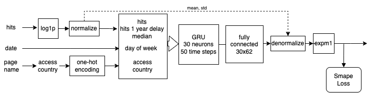
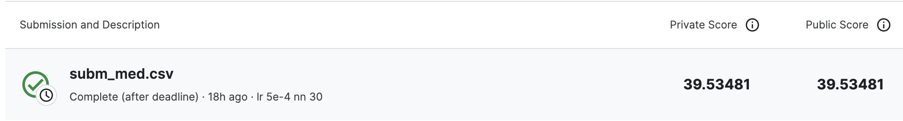
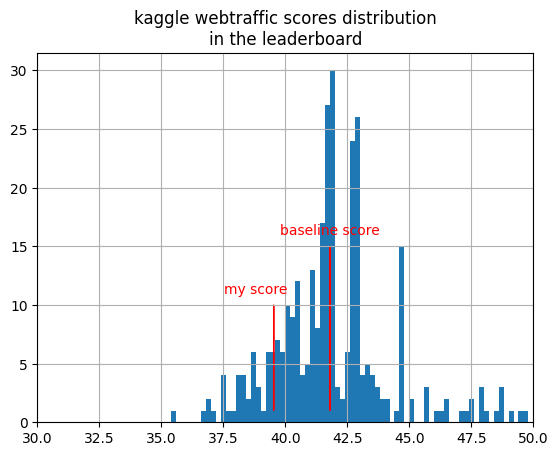

# WebTaffic Time Series Forecasting

This project is my solution to the "webtraffic forecasting" "kaggle competition.
Competition link : https://www.kaggle.com/competitions/web-traffic-time-series-forecasting


## My solution




My solution consists in a Gru RNN with 50-time steps. Here are the main ideas :
- Custom loss function (smape).
- log1p and normalization on traffic hits. The mean and standard variance are injected after the final dense layer to recover the dynamics of the original data before calculating the loss. 
- in addition to the hits, I injected the following features:
  - the one-hot encoded access from the page name (spider, desktop, etc.)
  - the one-hot encoded country from the page name ('en', 'fr', 'ja' etc.)
  - the day of the week (0 to 6)
  - the median (also transformed with log1p and normalization) because the signal strength has been lost during the hits normalization and the RNN will probably treat differently low traffic and high-traffic pages 
  - the one year delayed hits
- gradient descent is performed at every time step with the final timedistributed dense layer
- /!\ for the gradient descent, shuffle the hits it leads to better results
- /!\ take care of the lead time (3 days) between the last samples and the first prediction
- Then there are to steps to obtain the final predictions:
  - model fine tuning 
	- the test set target are the 62 last columns of the whole dataset (so the last 62 dates). Thus the test features are the values just before the target time steps. For the training set, we select the target samples so that there is no overlap with the test targets (there is overlap though with the test features set but not leading to any test-train leak). Note that this setup replicates the real condition of the competition.
  - submission step
	- the model is retrained using the last 62 traffic hits as the target, and previous steps for the training.
	- as there is no validation set to make early stoping, we use the optimal epoch number found in the previous fine tuning step to end the gradient descent. 


	
## Score


The score of the modèle is 39.5 (SMAPE, Symmetric mean absolute percentage error).  
The solution ranks approximately in the top 13% of scores.
On the figure below you can see the score of the solution among the other scores, and also the "baseline model" score which consists in using the median of the past number of hits as a prediction for the 62 futur values.




## Replicate the results (on Mac M1)

```
conda env create -n webtraffic -f conda-env.yaml
conda activate webtraffic
pip install -e .
```

Then, after downloading and unzipping the data in the directory 'data' at the root of the project, you can run the training with the script `webtraffic/train.py`.

Check the options with `python webtraffic/train.py --help`. 

I build the prediction for submission in 2 steps like said above:
- tuning step : `python webtraffic/train.py -v` to fine tune the parameters and check the score on the validation set
- submission : "blind training" (i.e. without validation set) on the last samples with `python webtraffic/train.py` 
